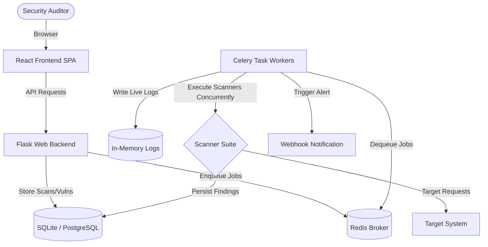

# 🛡️ SentinelScan — Website Security Scanner (WSS)

SentinelScan is a full-stack, enterprise-grade **Dynamic Application Security Testing (DAST)** platform designed to automate vulnerability detection across target domains and web APIs. Featuring a highly modular architecture, SentinelScan orchestrates a pipeline of custom security scanning agents concurrently, storing findings in a structured database and presenting them in a premium, real-time dashboard.

---

## 🚀 Key Features

* **Multi-Agent Concurrency**: Uses an asynchronous thread pool execution model (`ThreadPoolExecutor`) inside Celery tasks to run up to 17 specialized scanner modules in parallel.
* **Real-time Log Streaming**: Captures and exposes live, color-coded execution logs in-memory, enabling users to monitor active scans line-by-line.
* **Scheduled Scans**: Leverage Celery Beat to automate recurring scans (daily, weekly, monthly) for regular status monitoring.
* **Alert Webhooks**: Automatically dispatches security alerts to external services (e.g., Discord, custom webhooks) when critical or high vulnerabilities are discovered.
* **Authenticated Scanning**: Supports credentials/cookies injection via custom HTTP request headers, bypassing login perimeters to test deep backend routes.
* **Interactive Remediation**: Offers interactive, language-specific code remediation templates for each identified vulnerability type.
* **Dynamic PDF Reports**: Generates professional PDF summaries of completed scans, containing detailed risk score matrices and remediation guidelines.

---

## 📁 Directory Structure

```text
Project-WSS/
├── backend/                        # Flask Backend Application
│   ├── app/                        # Main Flask Application Package
│   │   ├── routes/                 # REST API Endpoints & Route Blueprints
│   │   │   ├── auth.py             # User Authentication (Login, Register)
│   │   │   ├── reports.py          # PDF Generation and Scan Reports
│   │   │   ├── scans.py            # Scan Configuration, Triggering, Logs
│   │   │   └── vulnerabilities.py  # Remediation & Vulnerability Queries
│   │   ├── scanners/               # Security Engine Modules & Core Pipelines
│   │   │   ├── __init__.py         # Pipeline Definitions and Class Dispatcher
│   │   │   ├── api_scanner.py      # Exposed REST API Route Finder
│   │   │   ├── base_scanner.py     # Abstract Base Class and Shared Log Utilities
│   │   │   ├── cloud_scanner.py    # Public S3/Cloud Storage Auditor
│   │   │   ├── cors_scanner.py     # CORS Misconfigurations Tester
│   │   │   ├── cve_scanner.py      # Vulnerability Database Version Matcher
│   │   │   ├── directory_scanner.py# Directory/File brute-forcer
│   │   │   ├── fuzzer_scanner.py   # SQLi & XSS Parameter Fuzzer
│   │   │   ├── headers_scanner.py  # HTTP Security Headers & Cache Poisoning
│   │   │   ├── nmap_scanner.py     # Port & Service Banner Scanner (via Nmap)
│   │   │   ├── nuclei_scanner.py   # Nuclei Template-based Scanner
│   │   │   ├── robots_scanner.py   # robots.txt Crawler
│   │   │   ├── secrets_scanner.py  # Page Secrets/API Key Scanner
│   │   │   ├── sslyze_scanner.py   # SSL/TLS Configurations & Ciphers Auditor
│   │   │   ├── subdomain_scanner.py# Subdomain DNS Enumerator
│   │   │   ├── tech_scanner.py     # Technology Stack Fingerprinting
│   │   │   ├── waf_scanner.py      # WAF Detection & Fingerprinting
│   │   │   ├── whois_scanner.py    # Domain Registrar and Whois Lookup
│   │   │   └── zap_scanner.py      # OWASP ZAP Active Spider Integration
│   │   ├── utils/                  # Utility Scripts & Helpers
│   │   │   ├── pdf_generator.py    # ReportLab PDF Generation
│   │   │   └── webhook.py          # Discord & Webhook Dispatcher
│   │   ├── database.py             # SQLAlchemy Extension Instance
│   │   ├── extensions.py           # Rate Limiter & Security Extensions
│   │   ├── models.py               # SQLAlchemy Database Models (SQLite/PostgreSQL)
│   │   └── scanner.py              # Celery Tasks, Beat Schedules & Orchestration
│   ├── celery_app.py               # Celery Broker and Beat Scheduler Configuration
│   ├── config.py                   # Environment Variable Parsing and App Constants
│   ├── requirements.txt            # Python Dependencies List
│   ├── run.py                      # Flask Application Startup Launcher
│   └── .env                        # Local Environment Secret Key Configurations
│
├── frontend/                       # React Frontend Application (Vite-powered SPA)
│   ├── src/                        # React Application Source
│   │   ├── assets/                 # SVGs, Fonts, and Static UI Elements
│   │   ├── components/             # Reusable UI Components
│   │   │   ├── AuthContext.jsx     # Global JWT Login State & API Interceptor
│   │   │   ├── CodeBlock.jsx       # Syntax-highlighted Remediation Viewer
│   │   │   ├── Layout.jsx          # Dashboard App Shell & Navigation Sidebar
│   │   │   ├── ProtectedRoute.jsx  # Auth Check Router Wrapper
│   │   │   └── ThreatGauge.jsx     # SVG Semi-circle Security Score Indicator
│   │   ├── pages/                  # Top-level Routing View Pages
│   │   │   ├── Dashboard.jsx       # Overview, Scan Metrics, and Status Cards
│   │   │   ├── LandingPage.jsx     # Modern Dark Mode Promotional Marketing Page
│   │   │   ├── Login.jsx           # Clean Secure Authentication Portal
│   │   │   ├── NewScan.jsx         # Target, Pipeline and Cookie Configurations
│   │   │   ├── Register.jsx        # Account Creation Portal
│   │   │   ├── ReportsHistory.jsx  # Past Scan Lists and Export Center
│   │   │   ├── ScanResults.jsx     # Vulnerability breakdown & Live terminal logs
│   │   │   └── Settings.jsx        # Notification threshold & webhook configuration
│   │   ├── App.css                 # Main Layout styling
│   │   ├── App.jsx                 # Routing configuration
│   │   ├── index.css               # Global theme tokens, inputs, animations
│   │   ├── main.jsx                # DOM Injection root
│   │   ├── mockApi.js              # Standalone local frontend mock testing DB
│   │   └── theme.css               # Precision Sentinel palette values
│   ├── vite.config.js              # React Hot Module Reloading server options
│   └── package.json                # Frontend NPM scripts & dependencies
│
└── docker-compose.yml              # Multi-container orchestrator (Redis service)
```

---

## 🏛️ System Architecture



### Backend Components
1. **Flask (REST API)**: Exposes endpoints for managing accounts, starting scans, listing results, downloading PDFs, and tracking setting updates.
2. **Celery Worker**: Dequeues scan tasks and runs them asynchronously. 
3. **ThreadPoolExecutor**: Multi-threads individual scanners inside a Celery task.
4. **Celery Beat**: Runs continuously to process scheduled periodic scans.
5. **Redis**: Acts as the fast in-memory message broker.

---

## 🗄️ Database Schema

The database schema, defined in `backend/app/models.py`, includes five main tables:

1. **`User`**: Manages credential hashing (via `bcrypt`) and session links.
2. **`Scan`**: Details the target domain, scan mode (Quick, Standard, Deep), authorization headers, overall security score, scan status, and timings.
3. **`Vulnerability`**: Stores findings linked to a scan. Contains details like CVSS score, severity classification, category, description, and copy-pasteable remediation snippets.
4. **`ScheduledScan`**: Saves user-configured scanning intervals (daily, weekly, monthly) for targets.
5. **`AlertSettings`**: Manages notification flags, webhook URL destinations, and minimum severity thresholds.

---

## ⚙️ Scan Pipelines

Pipeline routes are configured in `backend/app/scanners/__init__.py`. Depending on the target criticality and scan duration limits, auditors choose between:

| Pipeline | Target Speed | Underlying Scanner Suite | Description |
| :--- | :--- | :--- | :--- |
| **`Quick`** | ~30 seconds | Headers, Nmap (top 100 ports), SSLyze, Tech stack, WHOIS, WAF | Surface audit for standard misconfigurations |
| **`Standard`** | ~2–3 minutes | Quick + SQLi/XSS Fuzzer, Subdomains, API pathways, Cloud, Secrets, CVEs | Comprehensive assessment of application business logic |
| **`Deep`** | ~10–15 minutes| Standard + CORS, robots.txt, Directory brute-force, Nuclei, ZAP (active) | Deep crawling and automated vulnerability exploitation |
| **`SSL`** | ~15 seconds | SSLyze, Headers | SSL certificate validation and cipher security audit |
| **`Port`** | ~45 seconds | Nmap (standard 1000 ports) | Port and network service banner reconnaissance |

---

## 🛠️ The Scanner Suite (17 Specialized Modules)

Each scanner inherits from `BaseScanner` (`backend/app/scanners/base_scanner.py`) which coordinates logging, domain parsing, and vulnerability formatting:

1. **Headers Scanner (`headers_scanner.py`)**: Checks HTTP security headers (HSTS, CSP, CORS, X-Frame-Options, permissions, Referrer policy) and runs a custom check for HTTP host parameter cache poisoning.
2. **Nmap Scanner (`nmap_scanner.py`)**: Fires `nmap` commands directly via sub-process, checking exposed network services and testing for vulnerabilities using script scanning banners.
3. **SSLyze Scanner (`sslyze_scanner.py`)**: Audits SSL certificates, verifying trust status, expiration, and highlighting weak legacy protocols (TLS 1.0, SSLv3).
4. **Tech Scanner (`tech_scanner.py`)**: Fingerprints backend technologies, libraries, servers, and frameworks.
5. **Whois Scanner (`whois_scanner.py`)**: Looks up registrar information, IP ownership, and registration details.
6. **WAF Scanner (`waf_scanner.py`)**: Detects the presence of firewalls (Cloudflare, AWS WAF, ModSecurity, etc.) by inspecting response indicators.
7. **CORS Scanner (`cors_scanner.py`)**: Audits cross-origin resource sharing declarations to prevent credential leaks.
8. **Robots Scanner (`robots_scanner.py`)**: Parses target `robots.txt` entries to extract hidden directories or disallowed routes.
9. **Directory Scanner (`directory_scanner.py`)**: Brute-forces directories using wordlists to discover hidden panels (`/admin`, `/phpmyadmin`, `/api/v1`).
10. **Fuzzer Scanner (`fuzzer_scanner.py`)**: Performs automated query parameter fuzzing, validating parameters against Cross-Site Scripting (XSS) and SQL Injection (SQLi) patterns.
11. **API Scanner (`api_scanner.py`)**: Maps routing interfaces, documenting open APIs and JSON payloads.
12. **Cloud Scanner (`cloud_scanner.py`)**: Audits exposed public storage assets (AWS S3 Buckets, Azure Blobs, etc.).
13. **Secrets Scanner (`secrets_scanner.py`)**: Scrapes source HTML code for exposed keys, AWS access IDs, and connection credentials.
14. **CVE Scanner (`cve_scanner.py`)**: Cross-references identified technology versions against public vulnerability registries.
15. **Nuclei Scanner (`nuclei_scanner.py`)**: Performs targeted scans using ProjectDiscovery's template engine.
16. **ZAP Scanner (`zap_scanner.py`)**: Coordinates deep active spider scanning via the OWASP ZAP API integration.
17. **CORS/API Helper Scanners**: Secondary scanners focused on validation and authorization testing.

---

## 🚀 Setup & Local Execution

### Prerequisites
* **Python 3.10+**
* **Node.js v18+**
* **Nmap** (must be added to system `PATH` environment variables)
* **Redis** (running locally on port `6379`)

---

### Step 1: Start Redis
You can run Redis using Docker:
```bash
docker-compose up -d
```

---

### Step 2: Configure and Start Backend

1. Navigate to the backend directory:
   ```bash
   cd backend
   ```
2. Create a virtual environment and activate it:
   ```bash
   python -m venv venv
   # On Windows:
   venv\Scripts\activate
   # On Unix/macOS:
   source venv/bin/activate
   ```
3. Install dependencies:
   ```bash
   pip install -r requirements.txt
   ```
4. Verify your `.env` configuration. Ensure the keys and configurations are correct.
5. Seed the database and start the API server:
   ```bash
   python run.py
   ```
   *The Flask application will start on `http://127.0.0.1:5000`.*

---

### Step 3: Launch Celery Workers & Beat
Keep your backend running, open two new terminal sessions (with the virtual environment activated), and run:

1. **Celery Task Worker**:
   ```bash
   celery -A celery_app.celery worker --loglevel=info
   ```
2. **Celery Beat Scheduler**:
   ```bash
   celery -A celery_app.celery beat --loglevel=info
   ```

---

### Step 4: Configure and Run Frontend

1. Navigate to the frontend directory:
   ```bash
   cd ../frontend
   ```
2. Install npm modules:
   ```bash
   npm install
   ```
3. Start the Vite development server:
   ```bash
   npm run dev
   ```
   *The frontend application will boot on `http://localhost:5173`.*

---

## 🧪 Seeding and Testing

On the first initialization, the database is pre-seeded with a default user and dummy mock security scan data so you can preview the platform immediately:

* **Mock Account Email**: `admin@gmail.com`
* **Mock Account Password**: `admin123`

You can log in with these credentials, explore the interactive remediation code windows, trigger new scans, check your live-updating terminal dashboard logs, and download auto-generated PDF reports directly from the history view.
